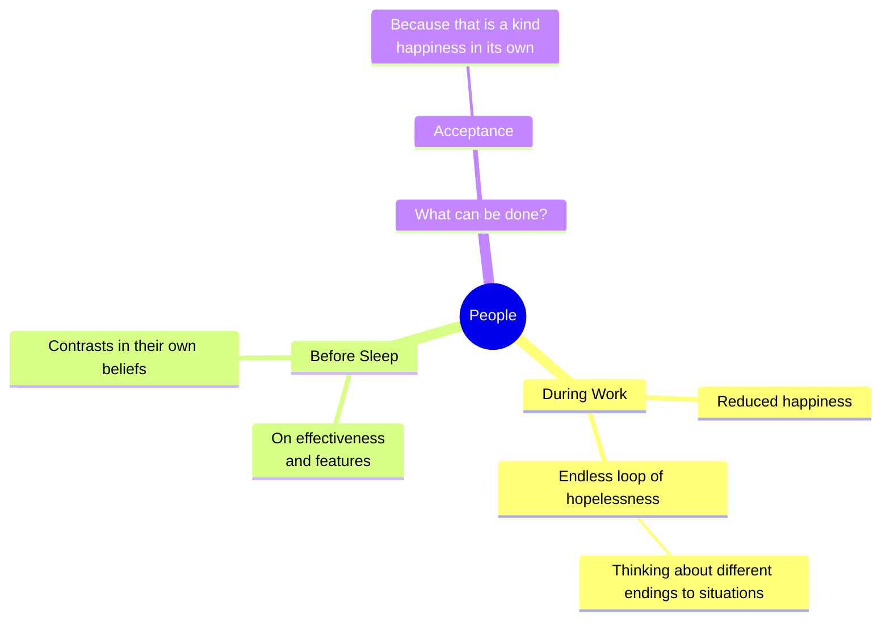
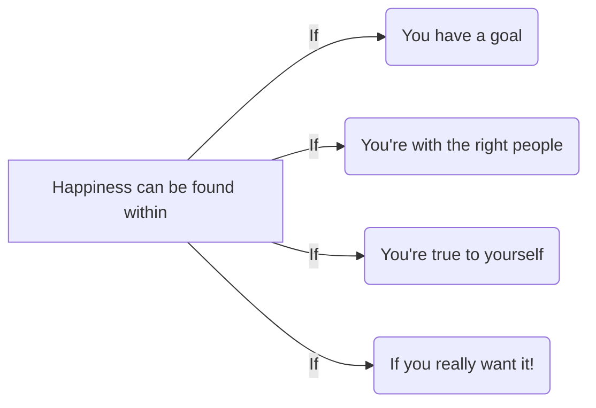

# What does the SKY tell you?

Hi! I'm **Paritosh**. Skies have always fascinated me and gave me special sense that everything needs to be looked at with a perspective unknown to the ever-so-growing brain of ours that knows how to differentiate between the emotions on one's behest but needs to know that sometimes, just letting things happen and shape the situation is the way to go. This blog is for one such emotion, **Happiness**...

# What exactly is Happiness?

Happiness is not just the feeling of achievement or success, it happens that this feeling comes along voluntarily with every task, but it's unlike **"easy come, easy go"**, you got to turn around your style, trace it through whatever you're doing and it will come to you. **Things should not be made more serious than they already are.**

---
## It's Different for everyone

There's this thing, when we exactly know what we want to get out of life, life eventually gives it to us, what we need is, to act. This is also happiness. Happiness is present in **every place**, **every job**. It lies in the littlest things right from eating your favorite food and listening your favorite song on loop to taking a hot water bath and roaming around hopelessly, everything got it's own joy and that everyone should taste it ! We try to **avoid** expressing this joy in the name of civilizing whereas the real spice is in making that moment worth reminiscing.

---

There's no reason for one to push away this joy, no need to care about embarrassment, share your hopes for the future, share you joy with other souls and tell people about the dreams you've never achieved; life will then throw at you, that stock of happiness that will last long and will be there in your heart forever. 

Whenever you feel like doing something, do it, because opportunities may knock twice but this time won't! Every moment is a **"Now or Never"** situation, so make it worth. Everything got its own price, so does our youth age. These memories come back later and are so clear and vivid, but for that one must have some to recollect, enjoy and laugh upon! 

The things that seem insignificant to most people such as a note, song or walk become invaluable treasures kept safe in your heart. There's one thing to understand:

>Everything that comes around goes around but not this, you have to grab hold of it just when you see it.

---

## We all think differently about common things, don't we?

Sometimes, it happens, like it's past midnight, random thoughts flaunt over their successful attempt of killing our sleep, awakening more and more contrasts that then break in, creating an endless loop of hopelessness, we just cannot understand what is happening then, but still we find a way to sleep and ultimately to peace and happiness, don't we? That is the reason everything has two endings, a happy and a sad one, it doesn't matter which one we end up with, what matters is **"Are we Happy?"**, results are always going to be the outcomes of our own actions only, happy in the sense that we must not have any regret that we could have done this, that and all, but we have done everything we could have and now whatever happens, we accept it, this is also happiness.

 
 

---
 

To summarize the value of happiness and to convey that happiness isn't a commodity that one can just buy but has to actually understand, this is a chart for the same:

 

 

 

## Stay Happy! Stay Cheerful!