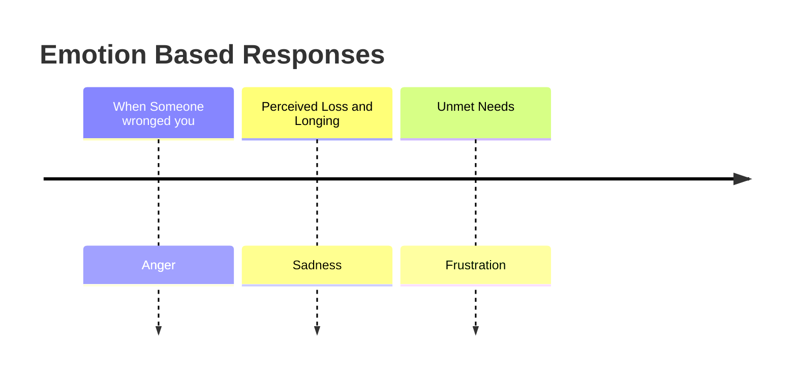

# We're made up of

Someone once said that **Mind** is a place where belief overcomes the facts and all of us somewhat believe it even though we might be too proud to admit it. So, this particular blog justifies the states that we're made up of.

## I mean we humans are quite similar as the universe:

Divided into different Parts:
* **Visible Matter**
Which we can consider as the happy part of our life which everyone can see
* **Dark Matter**
Which we can consider as the happy part of our life which everyone can see
* **Dark Energy**
Which is seemingly the most negative part which always lies inside us, inside everyone, and we just don't show it to people, we just we keep it to ourselves.
---

It's there but no one can see it, and just like all the functioning of the universe is done by this dark matter, the same way, it's with us, our dark energy which is the negative part of us does our functioning, it's the only thing responsible for the rest of the things, our **viable** matter and **dark** matter, everything is just controlled by this dark energy, like our subconscious, this dark energy of ours is only responsible for everything happening to us and still be remaining unknown to it, and still it always remains unseen to us  
>Happiness is hard to find, and some people spend their whole lives winning promotions, earning money, and spending time with people only to find that happiness has eluded them.

---

There's no reason for one to push away this joy, no need to care about embarrassment, share your hopes for the future, share you joy with other souls and tell people about the dreams you've never achieved; life will then throw at you, that stock of happiness that will last long and will be there in your heart forever. 

Whenever you feel like doing something, do it, because opportunities may knock twice but this time won't! Every moment is a **"Now or Never"** situation, so make it worth. Everything got its own price, so does our youth age. These memories come back later and are so clear and vivid, but for that one must have some to recollect, enjoy and laugh upon! 

The things that seem insignificant to most people such as a note, song or walk become invaluable treasures kept safe in your heart. There's one thing to understand:

>Everything that comes around goes around but not this, you have to grab hold of it just when you see it.

**It's like we’ve been sold on the idea of the power of positive thinking, from Affirmations to Optimism, if you want to succeed you must always look on the bright side but again, Happy Talk hasn't always been so mainstream**

#### NEGATIVE THINKING HELPS YOU AVOID FAILURE

>When we try to understand our dark energy negative results can strengthen our focus. 
---
### The Upside of your Dark Side
Beyond traits like hostility, violence, and jerkiness, negativity can also take the form of critical thinking and caution, which can heighten our awareness and potentially lead to better outcomes.

Asking yourself what you don't want to happen at work or in your personal life, then imagining how you might make the most of a bad situation, is a simple way to reap major benefits if we're courageous enough to handle the drawback of thriving while others suffer.

I mean concepts of positive and negative thinking, that if you think negative, then you will draw negativity in your life, and vice versa with positive thoughts, It makes total sense that if we go around thinking **"My life sucks, no one likes me, I'm a total failure and I'm not good at anything"**, then we're absolutely setting ourselves up to have those beliefs confirmed. At the same time, however, I do have negative thoughts, and I feel 'negative' feelings, and, overall, I am very happy with my life - not despite these negative thoughts and 'negative' feelings, but because of them.

We are all made up of multiple, seemingly contradictory parts, except that they're not contradictory, because at one point or another, they are completely rational, when we have a negative thought or feel a negative feeling, that is a big flashing neon sign that we have one or more unmet needs, that we are not living in a way that is aligned with our values, or that we are encountering external situations or people that aren't in line with our values.

---
I just like negative thoughts and feelings to some extent because they are useful, the whole giant or huge issue with **'positive thinking'** movements like the Law of Attraction, is that there is a huge danger in **willfully pushing away** negative thoughts and feelings, I mean even if I'll tell you think positive cause it happens what we think and like, but still Negative things happen, We experience crappy life events, we meet negative people, we have negative days where, through no fault of our own, negative stuff just happens that feels very negative, And at those times, we feel angry, hurt, sad, frustrated and a myriad of other called 'negative' emotions, not because we have trouble letting go of these thoughts and feelings, I mean but because we're humans.

---
Our dark energy is so good, it's just like having different triggers for different situations altogether: 

When we try to **'let go'** of these emotions, when we let go this dark energy feelings, we lose a vital part of our internal communication with our own soul.